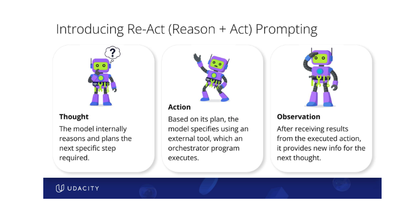

## Guide to LLM Thinking's process

## Chain-of-Thought (CoT)

- CoT is a prompting strategy that encourages the LLM to generate a sequences of intermediate reasoning steps before
  providing the final answer

### Zero Shot CoT

- "Let's think step by step" in prompt

### Few-shot CoT

- Include a few examples in your prompt where you show the problem, reasoning, and answer

```text
# example prompt
Is ‘3 + 1 \= 4’ correct? Work out your own solution step by step then compare it to mine.
```

### Self-Consistency Prompting

- Generating multiple reasoning paths or solutions for a given problem and then selecting the most frequent of
  consistent among them.
- This technique leverages the idea that by sampling different reasoning processes, the model can arrive at a more
  reliable and accurate conclusion.

## Reason + Act (ReAct)

- Prompting technique that synergizes "reasoning" and acting in LLM's by interleaving "thought" steps with "action"
  steps. 

```text
         -------- thought --------
         |                       |
       observation ---------- action
```

- The core of ReAct is its iterative loop: Thought, Action, Observation.

- Thought: The model internally reasons and plans the next specific step required to progress towards the overall task
  goal. It analyzes the situation, figures out necessary steps, and decides on an action.

- Action: Based on its plan, the model specifies using an external tool (like web search, calculator, API) with provided
  parameters. An "orchestrator" program then executes this tool. Tools are functions or services the agent can invoke.

- Observation: The model receives the results or feedback from the executed action (e.g., search results, calculator
  answer, confirmation of an email sent). This new information feeds into the next Thought. This observation, sometimes
  referred to as information from the "environment" if it's from the outside world like a weather report, then feeds
  back into the model's next Thought, allowing it to refine its plan or take subsequent actions.

This cycle repeats until the agent specifies an "action" to return the final result. _Each step is normally recorded in
the
message history of the chat._

Note:
ReACT (and agent) prompts are often long. It's not unusual for them to contain paragraphs of text and multiple parts.